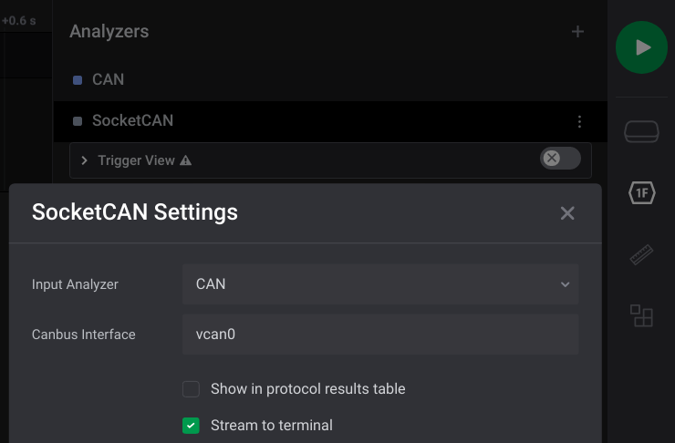
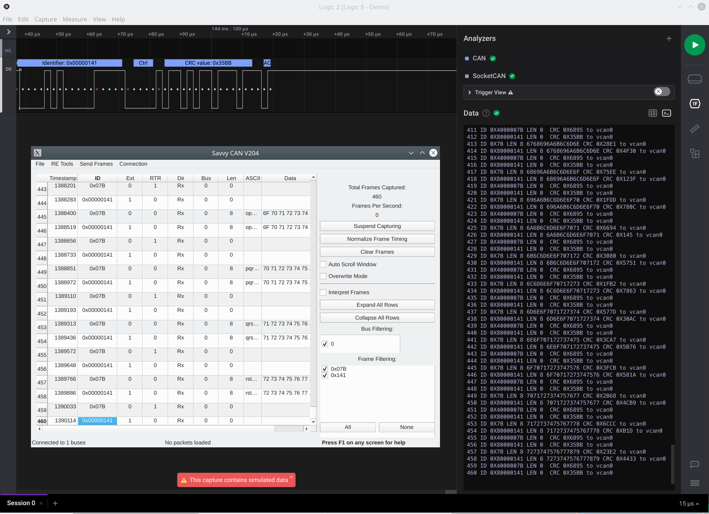

  # Salae Logic Analyser SocketCAN Forwarder 

This simple extension for [Saleae Logic 2.3.43](https://www.saleae.com/downloads/) or later forwards decoded CAN signals via a socketcan interface. This only works in Linux.

## Extension Settings

Configure your canbus interface in settings. You may need to first create a virtual can interface by running the following on the terminal:

```
sudo modprobe vcan
sudo ip link add dev vcan0 type vcan
sudo ip link set up vcan0
```

Then configure the extension settings as shown in the Figure below:

  


## Running the Extension

Simply start the CAN bus signal capturing and correctly decoded packets are forwarded via socketcan (vcan0 in this example).

